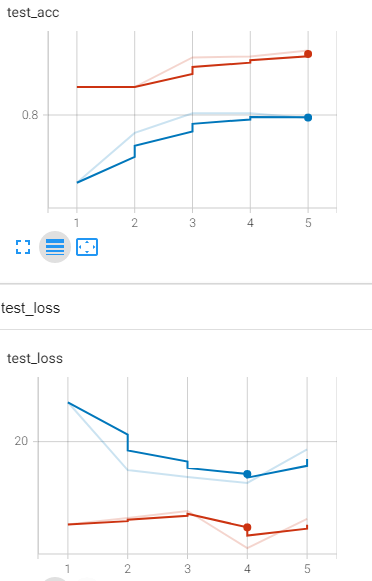
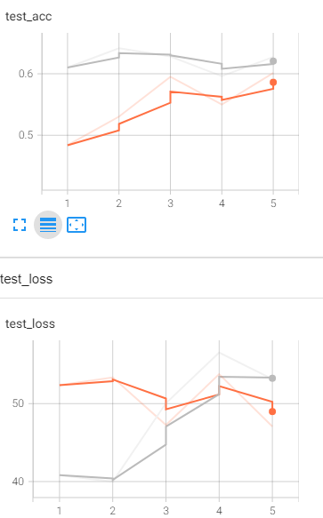
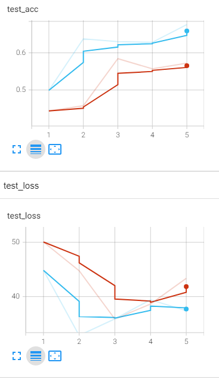
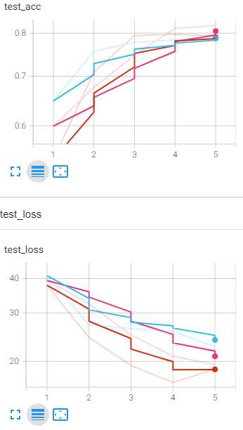

## Experiments
### Transformations
Epochs = 5, learning rate = 1e-4, batch size = 32
#### Fashion MNIST CCE Transformations
```tranformations = torchvision.transforms.AutoAugment(torchvision.transforms.AutoAugmentPolicy.IMAGENET)```

Red - no transformations

Blue - transformations


#### DTD CCE Transformations
```tranformations = torchvision.transforms.AutoAugment(torchvision.transforms.AutoAugmentPolicy.IMAGENET)```
#
Grey - no transformations

Orange - transformations


#### CIFAR CCE Transformations
```tranformations = torchvision.transforms.AutoAugment(torchvision.transforms.AutoAugmentPolicy.CIFAR10)```
#
Blue - no transformations

Red - transformations


## Probability distribution functions
### Fashion MNIST CCE
Red - softmax

Blue - soft-margin softmax (margin = 0.5)

Pink - taylor softmax



## Predefence review
The submitted text has Introduction with a goal, tasks and a description of the work structure. Chapter 1
covers the main theory underlying deep learning. Ch 2 is devoted to classification with deep neural networks.
Ch 3 is called methodology, but from the methodology perspective, there is very little. The selected datasets,
architecture and loss functions have been described. Ch. 3.3 ‘loss functions’ should be described somewhere
earlier, for example, in Ch.2. Ch 3 is related to methodology, therefore there must be described the
experiment plan what you plan to measure and how, not theory. There is no text related to the findings
coming from the experiments. It is not clear how far the student is with that. The work is missing the overview
of existing research related to loss function comparison. The motivation of the research is not clear.
Why AlexNet is described so detailed if VGG-11 is used for experiments?

Too much theory in the section
describing the methodology

## What to do in solution verification part?


