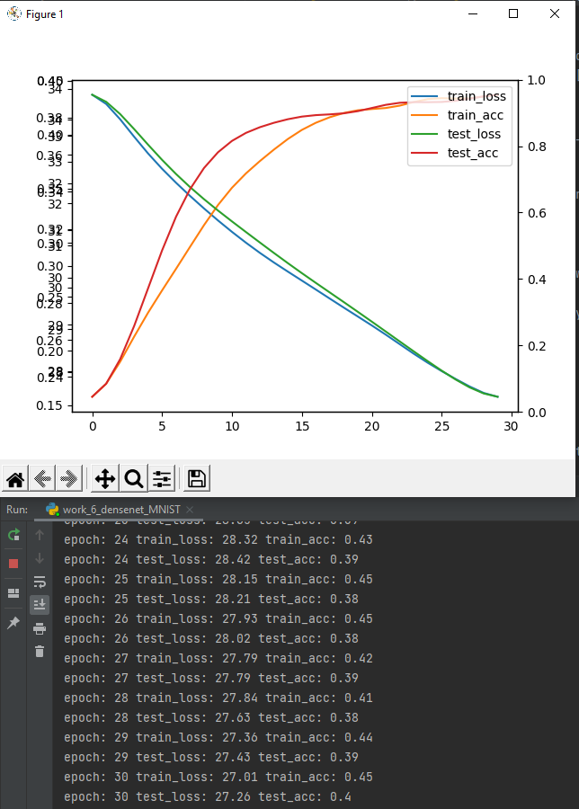
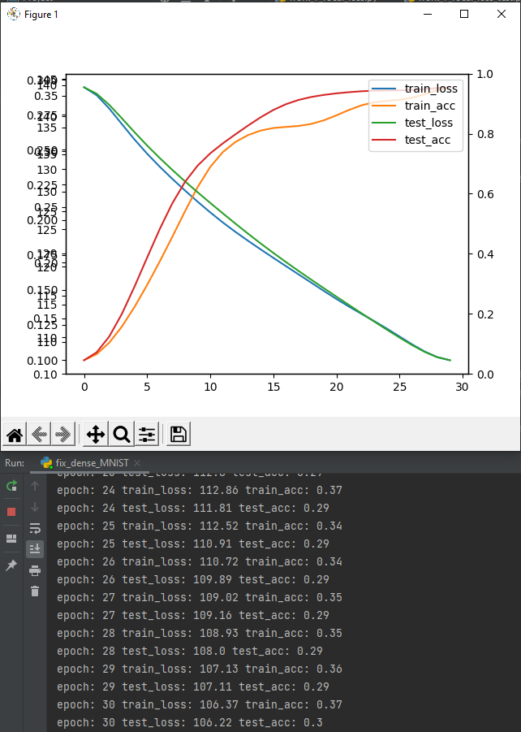
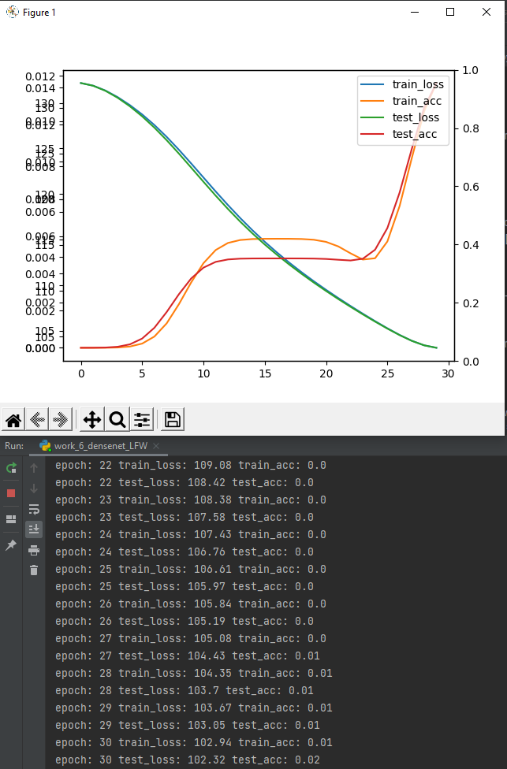
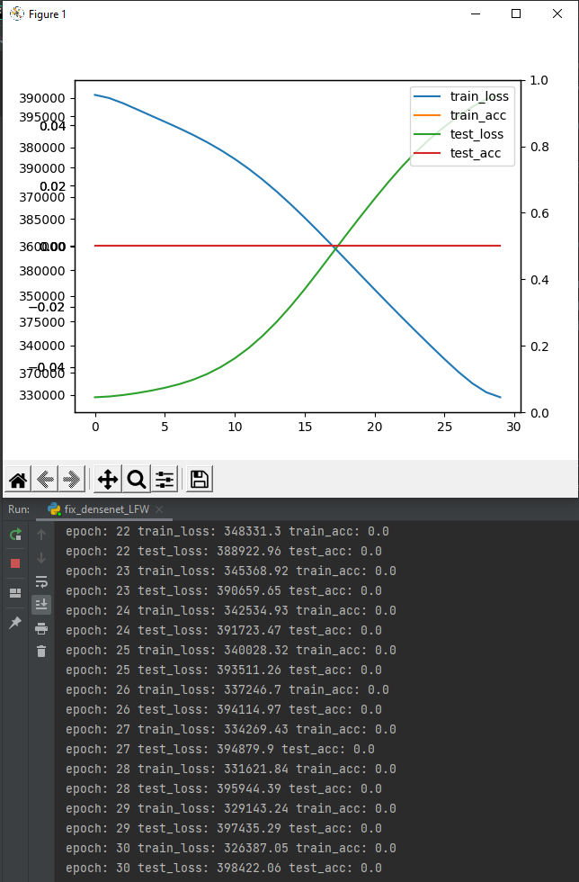

## Task 6
### Previous work fix DenseMNIST
#### Changes

##### Old

##### New

##### Old

##### New

#### Result comparison
The results with changes are usually a bit worse than the initial version, but as hot-one encoded vectors are not used, they new versions work faster.
##### Old

##### New

### Previous work fix LFW
#### Changes

##### Old

##### New

##### Old

##### New

#### Result comparison
The results are even more interesting
##### Old

##### New

### Focal loss
I have decided to use pre-trained vgg11 and Adam optimizer. I have been testing the model on Fashion MNIST dataset. However the results are quite odd.
#### Focal loss implementation

#### Results
The oddity comes from results, they are inconsistent and I can't find the dependancy. 
##### Sometimes model works like this:

##### Sometimes this happens:

##### Debugging yields this
